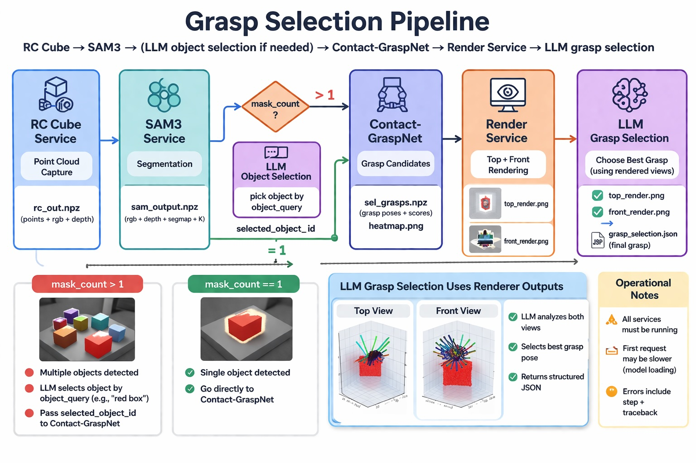

# BACHELOR THESIS BACKEND PIPELINE

## Overview
This project implements a modular microservice-based pipeline for context-aware robotic grasp selection.  
It combines perception, segmentation, grasp generation, reasoning, and rendering into a distributed system.

Main components:
- RC Cube Service            → stereo vision / point cloud acquisition
- SAM3 Service               → segmentation + object detection
- Contact-GraspNet Service   → grasp pose generation
- LLM Service                → semantic reasoning and grasp selection
- Render Service             → visualization of grasps
- Orchestrator               → pipeline coordination


## Dataflow

<div align="center">
  
</div>


## Project Structure

```
├── orchestrator
│   ├── app.py                → pipeline control logic
│   ├── config.yaml          → orchestrator config
│   └── Dockerfile
│
├── services
│   ├── rc_cube_service      → camera + depth acquisition
│   ├── sam3_service         → segmentation (SAM3)
│   ├── contactgraspnet_service → grasp prediction
│   ├── llm_service          → reasoning via LLM
│   └── render_service       → visualization
│
├── shared
│   ├── pipeline_io          → intermediate files between services
│   └── debug                → debug outputs
│
├── docker-compose.yml       → service orchestration
├── config.yaml              → global config
└── example.env              → environment variables
```


## Installation (Dev / GitHub Style)

### 1. Clone Repository

```
git clone <YOUR_REPO_URL>
cd bachelor-thesis-backend
```

### 2. Setup Environment Variables

```
cp example.env .env
```

Edit `.env` if needed:
- API keys (OpenAI, HuggingFace)
- RC Cube IP / socket address


### 3. Clone Required External Repositories

**SAM3**
```
cd services/sam3_service
git clone https://github.com/facebookresearch/segment-anything-3 sam3
```

**Contact-GraspNet**
```
cd ../contactgraspnet_service
git clone https://github.com/NVlabs/contact_graspnet.git
```

(Ensure checkpoints are placed in the correct directory)


### 4. Start System

```
cd ../../
docker compose up --build
```

Services:
- Orchestrator:        http://localhost:8000
- RC Cube Service:     http://localhost:8001
- SAM3 Service:        http://localhost:8002
- Contact-GraspNet:    http://localhost:8003
- LLM Service:         http://localhost:8004
- Render Service:      http://localhost:8005


## Pipeline Execution

```
curl -X POST http://localhost:8000/run_pipeline \
  -H "Content-Type: application/json" \
  -d '{
        "object_query": "green box"
      }'
```


## Data Flow

RC Cube → point cloud + RGB  
↓  
SAM3 → segmentation masks  
↓  
Contact-GraspNet → grasp candidates  
↓  
Render Service → visualization (top + front)  
↓  
LLM → semantic grasp selection  


## Shared Storage

`/shared/pipeline_io`  
→ intermediate artifacts between services  

`/shared/debug`  
→ debug outputs, visualizations, logs  


## Important Notes

- All services run in Docker containers  
- Code is mounted → no rebuild needed for code changes  
- Config is centralized in root `config.yaml`  
- Each service reads config at startup  


## Dependencies

System:
- Docker
- Docker Compose
- NVIDIA Container Toolkit (for GPU services)

Python (inside containers):
- Open3D
- PyTorch (SAM3 / CGN)
- OpenCV
- FastAPI
- NumPy


## GPU Usage

Required for:
- SAM3
- Contact-GraspNet

Configured via:
```
gpus: all
NVIDIA_VISIBLE_DEVICES=all
```


## Troubleshooting

EGL / Open3D crash:
→ set:
```
EGL_PLATFORM=surfaceless
```

→ install:
```
libegl1 libgl1-mesa-dri
```

Port conflicts:
→ adjust docker-compose ports  

Missing models:
→ ensure SAM3 + CGN repos + checkpoints are cloned  


## Development Notes

- Services are independent and loosely coupled  
- Communication via HTTP + shared files  
- Easy to extend with new modules  


## Minimal Dev Workflow

```
docker compose up
edit code
```

→ changes live via volume mounts


---

